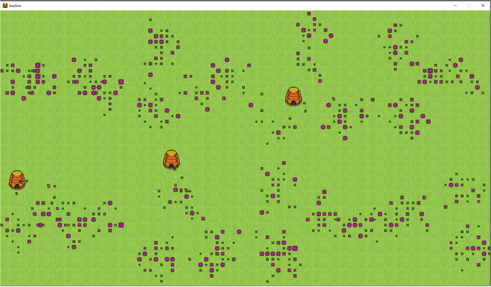
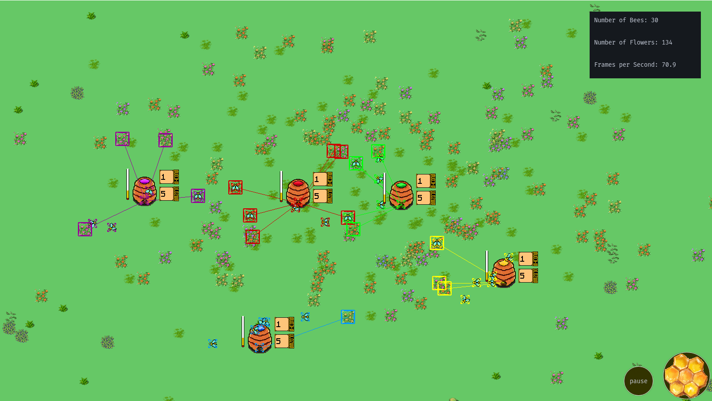
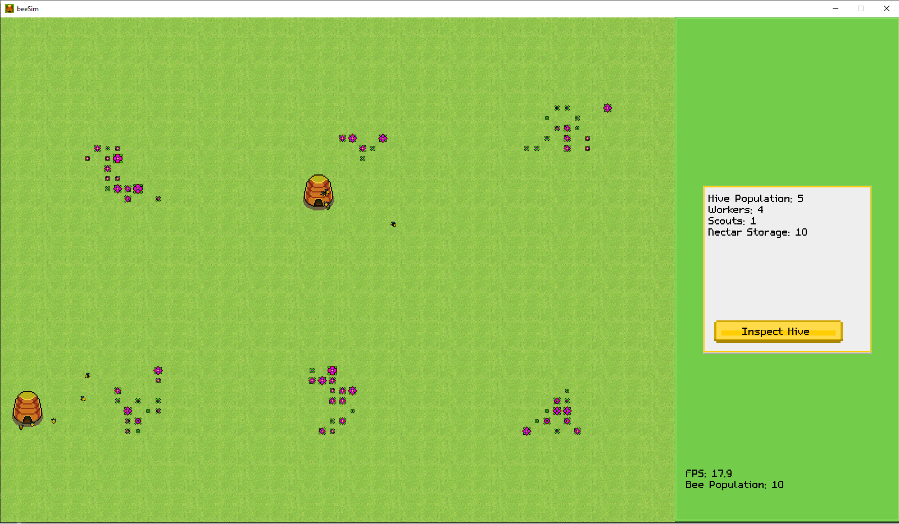

# BeeSim
An experiment in attempting to simulate the behavior of a bee hive and individual bees.
## Table of Contents
* [General info](#general-info)
* [Features](#features)
* [Setup](#setup)
* [UI Guide](#ui-guide)
* [Screenshots](#screenshots)
* [Acknowledgements](#acknowledgements)
### General info
BeeSim is an exploration into how complex behavior emerges from the interaction of individually simple entities. The central goal of the
simulation is to create emergent behavior without explicitly programming it.
- Language: Python
- Libraries: pygame for rendering

### Features
- Finite State Automata form the backbone of the project, each individual bee being an independent automaton.
- Procedurally generated environment.
- UI elements that allow the inspection of individual hives during simulation.
- Bees search and harvest nectar from nearby flowers, using it to feed themselves and expand the hive.
### Setup
Clone the repository, install the needed libraries if you have to and then run main.
### UI Guide
Click on the honeycomb button in the bottom right corner to bring up the main menu. Clicking on individual hives highlights them, their bees, their known flowers and displays how much nectar the hive has and the number of scouts and workers.
### Screenshots

### Acknowledgements
Bees for be(e)ing generally awesome and fluffy and Danie DiRuggiero for being the project's biggest supporter
### Diss-Acknowledgements
Wasps for being generally annoying and evil
